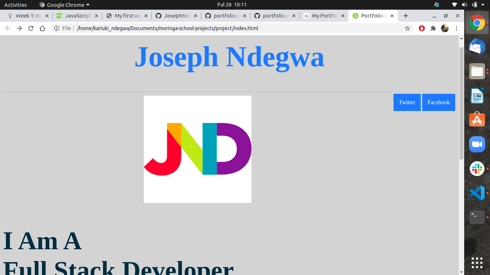

# My Portfolio Landing Page
This is my portfolio landing page
## App

### Author
Joseph Ndegwa

## Description
 This project seeks to showcase all  the skills that I have aquired in my first week at Moringa School. Furthermore, it also tells more about me including my educational background and career experiences.

 ## Setup and installation
- Run `git clone https://github.com/JosephNdegwa/portfolio-project.git`
- Serve on browser 
## Technologies used
* HTML
* CSS
* Git
* Github
* VS Code

## To do
* Include more functions with the skills I'll learn in the future
* Add more HTML functionality

# Link
[Portfolio](https://josephndegwa.github.io/portfolio-project/)

## Contact
* Kariukindegwa98@gmail.com

# License
[MIT](https://choosealicense.com/licenses/mit/)

Copyright (C) {2020}
